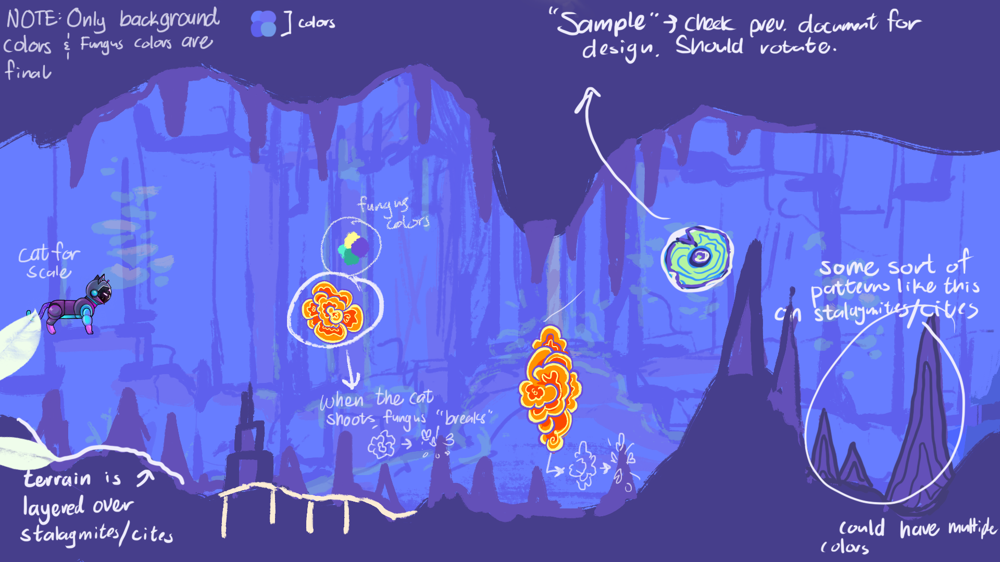

  
I am currently a founding member and lead software engineer for [Overture Games](https://www.overture.games/) where I am helping develop our first release title, *Intervallic*. It aims to make music practice for students by fun by gamifying practice and giving them goals to hit while practicing their instruments. The game supports audio input through MIDI and microphone, and will work with many instruments and vocals. Players must play the correct notes to advance through levels and can play certain intervals to activate special abilities or mechanics.

I've gotten to build a lot of really cool tech for this game. I've created a level editor that allows users to provide their own music and design levels around their skills. On the systems side I made many internal tools and did a lot of work with platform integration and player metrics collection. But my work can also be seen on more user-facing features including gameplay and audio/pitch detection.  Outside of just technology, I've learned a lot about how the fundraising process works and how to work through difficult times as a team.

Overture is still a quite small team, so I often get to wear a lot of hats. Depending on the day I might act as a writer, producer, business analyst, technical designer, QA tester, or many other critical roles in game and software development. It's been a really awesome way to explore all of the different sides of the industry and has helped me become a more well-rounded developer.

Here's a bit of concept art, or you can see our latest trailer and screenshots on Steam!
  
    

## Release information

Our latest demo available for free on [Steam](https://store.steampowered.com/app/2270460) and [itch](https://overturegames.itch.io/intervallic)!

An Early Access version with more content is planned September 29th, 2023. In the meantime, feel free to join our [Discord](https://discord.gg/8qn2m3uKan) for updates!

## Media featuring Intervallic

08/15/2022  |  [Overture Games Team Spotlight](https://thegarage.northwestern.edu/news/overture-games-team-spotlight/)  \
11/21/2022  | [Glimpse under the hood: The Garage’s undergraduate projects](https://dailynorthwestern.com/2022/11/21/photo/captured-glimpse-under-the-hood-the-garages-undergraduate-projects) \
05/05/2023  | [The Next Generation of Game Developers: Talking with Overture Games About Inspiration and Innovation](https://www.sceneandheardnu.com/content/2023/5/5/the-next-generation-of-game-developers-talking-with-overture-games-about-inspiration-and-innovation) \
05/14/2023  | [NU Declassified: Built This – Overture Games aims to turn practice into play](https://dailynorthwestern.com/2023/05/14/audio/nu-declassified-built-this-overture-games-aims-to-turn-practice-into-play/) \
05/23/2023  | [What's cooking in Northwestern's startup hub](https://www.chicagobusiness.com/crains-daily-gist/checking-startup-progress-northwesterns-garage)